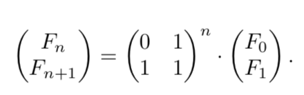

# Big O

O: f grows no faster than g if there is a constant $c > 0$ st $f(n) \leq c g(n)$ 

|               | $\lim_{n\to\infty}\frac{f(n)}{g(n)} \neq$ | Meaning                   |
| ------------- | ----------------------------------------- | ------------------------- |
| $f=O(g)$      | $\infty$                                  | $f \leq g$                |
| $f=\Omega(g)$ | $0$                                       | $g = O(f)$                |
| $f=\Theta(g)$ | $0, \infty$                               | $f = O(g), f = \Omega(g)$ |

## Common Sense Rules

1. Omit mult constants
2. $n^a$ dominates $n^b$ if $a > b$
3. Any exp dominates any poly (ex. $3^n$ dominates  $n^5$)
4. Any poly dominates any log (ex. $n$ dominates $(\log n)^3$)

## Examples

ex1. $f_1(n)=n^2, f_2(n)=2n+20$

$2n + 20 \leq 22n \leq 22n^2$

ex2. $f_2(n), f_3(n) = n + 1$

$2n + 20 \leq 22n \leq 22(n + 1)$

$n+1 \leq 2(n+1) \leq 2n + 20$

# Exercises

1. Indicate $f=O, \Omega, \Theta(g)$

| Part | f(n)                | g(n)               |          |
| ---- | ------------------- | ------------------ | -------- |
| a    | n - 100             | n - 200            | $\Theta$ |
| b    | $n^{\frac{1}{2}}$   | $n^{\frac{2}{3}}$  | $O$      |
| c    | $100n + \log n$     | $n + (\log n)^2$   | $\Theta$ |
| d    | $n \log n$          | $10n \log 10n$     | $\Theta$ |
| e    | $\log 2n$           | $\log 3n$          | $\Theta$ |
| f    | $10\log n$          | $\log(n^2)$        | $\Theta$ |
| g    | $n^{1.01}$          | $n\log^2n$         | $\Omega$ |
| h    | $n^2/\log n$        | $n(\log n)^2$      | $\Omega$ |
| i    | $n^{0.1}$           | $(\log n)^{10}$    | $\Omega$ |
| j    | $(\log n)^{\log n}$ | $n/\log n$         | $\Omega$ |
| k    | $\sqrt n$           | $(\log n)^3$       | $\Omega$ |
| l    | $n^{\frac{1}{2}}$   | $5^{\log_2 n}$     | $O$      |
| m    | $n2^n$              | $3^{n}$            | $\Omega$ |
| n    | $2^n$               | $2^{n+1}$          | $\Theta$ |
| o    | $n!$                | $2^{n}$            | $\Omega$ |
| p    | $(\log n)^{\log n}$ | $2^{(\log_2 n)^2}$ | $O$      |
| q    | $\sum_{i=1}^{n}i^k$ | $n^{k+1}$          | $O$      |

c. $\lim_{n\to\infty}\frac{f(n)}{g(n)} = \lim_{n\to\infty}\frac{100n + \log n}{n + (\log n)^2} = \lim_{n\to\infty}\frac{100n + \frac{\log n}{n}}{n + \frac{(\log n)^2}{n}} = 100$

h. $\lim_{n\to\infty}\frac{f(n)}{g(n)} = \frac{n^2/\log n}{n(\log n)^2} = \frac{n}{(\log n)^3} = \infty$ (continuously apply L'Hoptial's Rule)

j. $\lim_{n\to\infty}\frac{f(m)}{g(m)}$ where $m = \log n$, $n = 2^m$

$\frac{(m)^m}{2^m/m} = m(\frac{m}{2})^m = \infty$

l. $5^{\log_2 n} = (2^{\log_2 5})^{\log_2 n} = 2^{(\log_2 n)(\log_2 5)} = n^{log_2 5}$

$\frac{n^{0.5}}{n^{\log_2 5}} = n^{0.5 - \log_2 5} = n^{-1.82}$ 

$\lim_{n\to\infty}\frac{f(n)}{g(n)} = 0$

p. $g(n) = 2^{(\log_2 n)(\log_2 n)} = n^{\log_2 n}$

​    $f(n) = (2^{\log_2 \log n})^{\log n} = (2^{\log_2 n})^{\log(\log(n))} = n^{\log\log(n)}$

2. If $c > 0$, $g(n) = 1 + c + c^2 + ... + c^n$ is:

   a) $\Theta(1)$ if $c < 1$

   infinite geometric series with $r < 1$ will converge to constant, so must a finite geometric series

   

   b) $\Theta(n)$ if $c = 1$

   if c = 1, g(n) = 1 for all n

   

   c) $\Theta(c^n)$ if $c > 1$

   $a\frac{1 - r^n}{1-r}$ where $a = 1$ and $r = c$

​       $\frac{r^n - 1}{r - 1} = \Theta(r^n)$

3. Confirm Fibonacci sequence grows exp

   a) Use induction to prove $F_n \geq 2^{0.5n}$ for $n \geq 6$

   Base case: $n = 6$

   $F_6 = 8$

   $2^{0.5 \cdot 6} = 2^3 = 8$

   

   Inductive Hypothesis: For $k \geq 6$, if $F_k \geq 2^{0.5 \cdot k}$ then $F_{k+1} \geq 2^{0.5 \cdot (k + 1)}$

   

   Inductive Step: $F_{k+1} = F_{k} + F_{k - 1} \geq 2^{0.5 \cdot k} + 2^{0.5 \cdot (k-1)}$ 

   $= 2^{0.5 \cdot (k-1)}2^{0.5} + 2^{0.5 \cdot (k-1)} = (2^{0.5} + 1)2^{0.5 \cdot (k-1)}$

   $= \frac{2^{0.5} + 1}{2^{0.5}}2^{0.5 \cdot k}$

   $\geq 2^{0.5}2^{0.5k} = 2^{0.5 \cdot (k + 1)}$

   

   b) Find constant $c < 1$ st $F_n \leq 2^{cn}$ for all $n \geq 0$

   $2^{c\cdot(n-1)} + 2^{c\cdot(n-2)} \leq 2^{cn}$

   $2^{cn - c} + 2^{cn - 2c} \leq 2^{cn}$

   $2^{-c} + 2^{-2c} \leq 1$

   $2^c + 1 \leq 2^{2c}$

   $-x^2 + x + 1 \leq 0$

   $x^2 - x - 1 \geq 0$

   

   $x \geq \frac{1 + \sqrt 5}{2}$

   $\frac{1 - \sqrt 5}{2} \leq x < 0$ (no solutions)

   

   $2^{c + 1} \geq 1 + \sqrt 5$

   $\log(2^c \dot 2) \geq \log(1 + \sqrt 5)$

   $c \geq \log(1 + \sqrt 5) - 1$

   

   c) What is the largest c you can find for which $F_n = \Omega(2^{cn})$

​           Take $c = \log(1 + \sqrt 5) - 1$

4. Compute Fibonacci in a way even faster than O(n)

   a) Two 2 x 2 matrices are by def done with 8 multiplications and 4 additions.

   

   b) $O(\log n)$ matrix mults needed to compute $X^n$

   ​	As suggested, $F_8$ requires a power of 8 on the constant matrix. This can be broken down into 4 x 4, then 2 x 2, then 1 x 1. Taking $3 = \log(8)$ steps.

   

   c) Prove intermediate results are O(n) bits long.

   ​	For odd k, $F_k = [[0,1],[1,1]] \cdot F_{\lfloor k/2 \rfloor} \cdot F_{\lfloor k/2 \rfloor}$

   ​	For even k, $F_k = F_{\lfloor k/2 \rfloor} \cdot F_{\lfloor k/2 \rfloor}$

   

   ​	Base Cases: $F_0, F_1$ O(1) bits long

   ​	Inductive Hypothesis: Assume $F_i$ are O(n) bits long for $1 \leq i < k$

   ​	Inductive Step:

   ​		odd: mult O(1) numbers w/ O(k/2) bit numbers then again => O(k)

   ​		even: mult O(k/2) bit numbers twice => O(k)

   

   d) M(n): run time of algo mult n-bit numbers

   ​    Assume $M(n) = O(n^2)$. Prove running time is $O(M(n)\log n)$.

   ​	

   ​	Needs $O(\log n)$ mults, each taking $O(M(n))$ time

   

   e) Prove running time of algo is $O(M(n))$.

   ​    For odd k, $F_k = [[0,1],[1,1]] \cdot F_{\lfloor k/2 \rfloor} \cdot F_{\lfloor k/2 \rfloor}$

   ​	For even k, $F_k = F_{\lfloor k/2 \rfloor} \cdot F_{\lfloor k/2 \rfloor}$

   

   ​	Base Cases: $F_0, F_1$ runtime O(1)

   ​	Inductive Hypothesis: Assume $F_i$ takes $O(M(n))$ for $1 \leq i < k$

   ​	Inductive Step: $F_{\lfloor k/2 \rfloor}$ => $O(M(k/2))$

   ​		Overall mult requires $O(M(k))$ time

